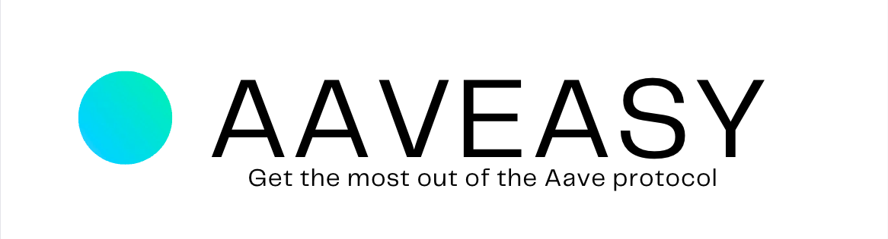

<br>


# AAVEASY
## Get the most out of the Aave protocol


**Aaveasy** is a platform that allows users to easily interact with the **Aave** protocol. It allows users to deposit and withdraw their assets, borrow and repay their loans, and also allows users to login using their social media accounts powered by **arcana**.


<br>

## Demo

### Home Page


 


<br>
Insert gif here


<br>

Github : <a style="margin-bottom: 5px;" href="https://github.com/Novobloc/aaveasy" target="_blank"> Repo Link </a>

Video : <a style="margin-bottom: 5px;" href="" target="_blank"> Youtube Link </a>


## Stack We Used


1. Frontend: We used **React JS**, Tailwind CSS for UI and **ethers** library to fetch details from contract.

2. Blockchain :
   1. Arcana: We used **Arcana SDK** for like social login and wallet.
   2. Aave: We used **Aave SDK** to connect with Aave protocol.
   3. Graph Protocal: We used subgraph to fetch the price of assets of aave.
   4. Chain: **Ethereum Goerli** to connect with blockchain on testnet.
   5. RPC URL : We used **Quick Node** Ethereum RPC url to connect to the goerli chain.


## Steps to Run the Project

1. Clone the repo

```
git clone https://github.com/Novobloc/aaveasy
```

2. Install the dependencies.

```
 npm i
```

3. Start the app using command

```
npm start
```

4. Open this link in browser http://localhost:3000

5. Hey, You just ran the code in your system, thats it. Now you can invest in aave .

<br>

## Meet Our Team

<div style="display: flex; justify-content: space-between; align-items: center;">
   <p style="flex:1">Shiva Kumar: </p>
   <div style="flex:4; justify-content: space-between;">
      <a href="https://www.linkedin.com/in/shivamangina/" target="_blank">
      
      </a>
      <a href="https://twitter.com/shivakmangina" target="_blank">
      
      </a>
      <a href="https://www.instagram.com/shiva_mangina" target="_blank">
      
      </a>
      <a href="https://github.com/shivamangina" target="_blank">
      
      </a>
   </div>
</div>

<div style="display: flex; justify-content: space-between; align-items: center;">
   <p style="flex:1">Sandeep Kumar: </p>
   <div style="flex:4; justify-content: space-between;">
      <a href="https://www.linkedin.com/in/satyasandeep" target="_blank">
      
      </a>
      <a href="https://twitter.com/satyasandeep76" target="_blank">
      
      </a>
      <a href="https://www.instagram.com/satyasandeep007" target="_blank">
      
      </a>
      <a href="https://github.com/satyasandeep007" target="_blank">
      
      </a>
   </div>
</div>